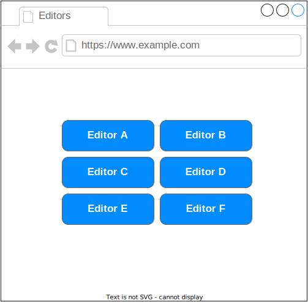
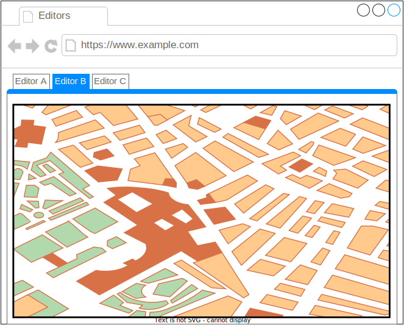

# Gestire più istanze OSM

Supponiamo di voler mettere in piedi _n_ istanze di OSM, ognuna con una propria mappa e un tile server accoppiato, e che siano accessibili e modificabili con l'editor iD.
Inoltre nell'interfaccia deve essere presente un controller che permette all'editor di cambiare il database di lavoro in tempo reale.

## Una possibile soluzione
Innanzitutto bisogna inizializzare le _n_ istanze del docker-compose, in quanto ogni istanza deve avere:

- Il servizio `db`, cioè il container del database Postgres
- Il servizio `map`, che è il container del tile server
- Il servizio `web`, ovvero il container del sito web e dell'editor iD.

### È proprio necessario il servizio _web_?
Si perché, oltre a far visualizzare e modificare la mappa, questo servizio espone anche un'API HTTP che è fondamentale per iD o per qualunche altro editor.  

A questo punto si può procedere in due modi:

### Modo 1
Costruire una pagina web che permette di scegliere a quale editor collegarsi.
Di seguito sono mostrati due mockup di interfaccia grafica.

|
:-------------------------:|:-------------------------: 
_Figura 1: Interfaccia a bottoni_ | _Figura 2: Interfaccia a schede_

Il primo sketch modella un'interfaccia semplice in cui ci sono _n_ pulsanti che aprono l'editor desiderato in un'altra scheda del browser.
Il secondo rappresenta una schermata un po' più elaborata in cui ci sono _n_ schede e ognuna di esse contiene un _iframe_ che incapsula la pagina dell'editor selezionato.
Per quest'ultima soluzione è necessario modificare le _X-Frame-Options_ nell'header HTTP del sito web [1](https://developer.mozilla.org/en-US/docs/Web/HTTP/Headers/X-Frame-Options).

### Modo 2
Modificare l'interfaccia di iD.  
Questa strada è un po' più difficile da percorrere in quanto bisogna apportare delle modifiche nel codice javascript dell'editor.
Ma non è necessario creare nulla di nuovo: iD ha delle funzionalità che permettono di scegliere in tempo reale quale istanza di OSM modificare. Queste funzionalità sono state nascoste nel sito di openstreetmap, ma possono essere riattivate.
Di seguito ci sono alcuni suggerimenti su dove poter mettere le mani.

- Invertire le modifiche fatte con la pull-request [#3792](https://github.com/openstreetmap/openstreetmap-website/pull/3792) per ripristinare lo switch "live/dev" [4](https://github.com/openstreetmap/openstreetmap-website/pull/3792)  presente in basso a destra della schermata.
È sufficente sostituire il file `app/assets/javascripts/id.js` con quello scaricabile da https://github.com/openstreetmap/openstreetmap-website/blob/b3e5af0ee83bfe97882f462972184d8697ef3237/app/assets/javascripts/id.js
- Modificare/aggiungere più voci in `vendor/assets/iD/iD/locales/it.min.json` o in `vendor/assets/iD/iD/locales/en.min.json` nella entry `source_switch` (per modificare la scritta "live/dev" su iD)
- Modificare/aggiungere nuove connessioni nell'oggetto alla riga 22868 in `vendor/assets/iD/iD.js`
- Trovare un modo per modificare questo switch e sostituirlo con un menù a tendina o un altro controller (presumibilmente sempre dentro `vendor/assets/iD/iD.js` riga 74240).
- Modificare/creare ex novo il file `vendor/assets/iD/iD/data/imagery.min.json` per poter aggiungere nuove fonti delle tile selezionabili nelle impostazioni di sfondo dell'editor.

## Fonti
1. https://developer.mozilla.org/en-US/docs/Web/HTTP/Headers/X-Frame-Options
2. https://github.com/openstreetmap/iD/issues/4288 - Switching server while loading causes glitchy behavior
3. https://github.com/openstreetmap/iD/issues/4405 - Allow switching of servers on preview.ideditor.com
4. https://github.com/openstreetmap/openstreetmap-website/pull/3792 - Hide live/dev server switcher on integrated iD editor
